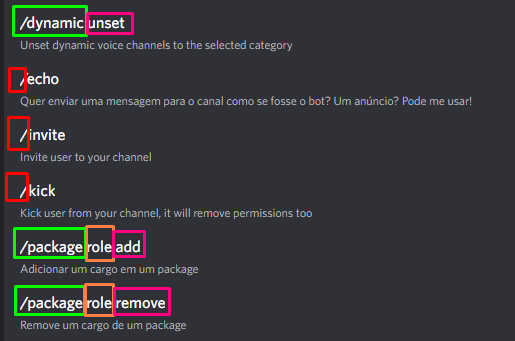

<div align="center">

# Curupira
[](https://github.com/Softawii/curupira/actions/workflows/gradle.yml)
[](https://jitpack.io/#Softawii/curupira)

</div>

### Install with Gradle

```
repositories {
    maven { url 'https://jitpack.io/' }
}
    
dependencies { 
    implementation("com.github.Softawii:curupira:VERSION:all")
}
```
### Why would you use _Capivara_?

It is used to automatically create and link functions to discord actions just in one point, the JDA library does not allow you to do it,
so maintenance can be done more easily

### How it works?

_Curupira_ is an auxiliary library for creating commands for _Discord_ with JDA. The library will automatically create 
and link commands to your functions with an annotation mechanism.

#### Start

You can start the JDA in your own way, being only necessary to pass the reference to the Curupira constructor.

Here you can see an example in [Capivara](https://github.com/Softawii/capivara):

> [SpringConfig.java#L88-L107](https://github.com/Softawii/capivara/blob/v1.0.5.2/src/main/java/com/softawii/capivara/config/SpringConfig.java#L88-L107)
```java
@Bean
public Curupira curupira(JDA jda) {
    // Packages to scan classes
    String  pkg      = "com.softawii.capivara.listeners";
    
    // Reset: It will recreate all the commands on the discord side, usually only used in updates!
    String  resetEnv = env.getProperty("curupira.reset", "false");
    boolean reset    = Boolean.parseBoolean(resetEnv);
    
    // null is the exception handler, you don't need to use it
    // it is used to send unexpected erros to a us
    // you can take a look in capivara
    return new Curupira(jda, reset, null, pkg);
}
```

#### Ok! How to Create my Commands?

First, you need to create your groups. Groups are classes containing commands, 
usually you create a class with commands that are related.

We have 2 annotations to it, `@IGroup` and `@ISubGroup`

##### @IGroup

It is used to create a class of commands, you can hide the class from the command and the class will not appear in the command

#### @ISubGroup

It is used to create a subcommand, it is used in inner classes

#### Example



| **Color** |   **Type**   | **@Annotation** |
|:---------:|:------------:|:---------------:|
|   Green   |     Class    |      IGroup     |
|   Orange  |  Inner Class |   ISubCommand   |
|    Pink   |    Method    |     ICommand    |
|    Red    | Hidden Class |                 |

### What about the commands?

You can use the annotation `@ICommand` to create your commands, you can create SLASH, USER or MESSAGE 
commands and set environments (SERVER, PRIVATE or BOTH) to it.

The command needs a name, description and may have required permissions to use. 

Another example in Capivara:

> [VoiceGroup.java#L438-L457](https://github.com/Softawii/capivara/blob/v1.0.5.2/src/main/java/com/softawii/capivara/listeners/VoiceGroup.java#L438-L457)
```java
@ICommand(name = "invite", description = "Invite user to your channel")
@IArgument(name = "user",
           description = "User to invite",
           required = true, type = OptionType.USER)
public static void invite(SlashCommandInteractionEvent event) {
    Member member  = event.getMember();
    Member invited = event.getOption("user").getAsMember();

    AudioChannel channel = Dynamic.validateRequest(event, member);
    if (channel == null) return;

    VoiceChannel voice = (VoiceChannel) channel;
    voice.createInvite().setUnique(true).deadline(System.currentTimeMillis() + Dynamic.inviteDeadline).queue(q -> {
        voice.getManager().putPermissionOverride(invited, List.of(Permission.VIEW_CHANNEL, Permission.VOICE_CONNECT), Collections.emptyList()).queue();
        String name = member.getEffectiveName() + (member.getNickname() != null ? " (" + member.getNickname() + ")" : "");
        invited.getUser().openPrivateChannel().queue(chn -> chn.sendMessage(name + "invited you to join in a channel!\n" + q.getUrl()).queue());
        event.reply("Invite sent to " + invited.getAsMention()).setEphemeral(true).queue();
    });
}
```

Along with `@ICommand` you can use `@IArgument` and `@IRange`, both are used to create arguments to your commands.

`@IArgument` is used to create a single parameter, like 'user', and 
`@IRange` is used to create a group of parameters, like 'user1, user2, user3, ..., userN'

### Buttons, Menus and Modals

`@IButtons` and `@IMenus` are so simple, just give an id and it's working!

Example in Capivara:

> [VoiceGroup.java#L322-L338](https://github.com/Softawii/capivara/blob/v1.0.5.2/src/main/java/com/softawii/capivara/listeners/VoiceGroup.java#L322-L338)
```java
@IButton(id = droneConfig)
@SuppressWarnings({"unused"})
public static void droneConfigButton(ButtonInteractionEvent event) {
    MessageChannelUnion channel = event.getChannel();

    Modal modal;
    try {
        modal = droneManager.checkConfigDrone(event.getGuild(), channel, event.getMember(), droneConfig);
    } catch (KeyNotFoundException e) {
        event.reply("This channel is not a temporary channel!").queue();
        return;
    } catch (MissingPermissionsException e) {
        event.reply("You don't have the required permissions to manage this channel!").queue();
        return;
    }
    event.replyModal(modal).queue();
}
```

> [EchoGroup.java#L373-L398](https://github.com/Softawii/capivara/blob/v1.0.5.2/src/main/java/com/softawii/capivara/listeners/EchoGroup.java#L373-L398)
```java
@IMenu(id = menuEditField)
public static void editFieldMenu(SelectMenuInteractionEvent event) {
    SelectOption selectOption = event.getSelectedOptions().get(0);
    String       id           = event.getComponentId().split(":")[1];

    int index = Integer.parseInt(selectOption.getValue());

    if (index >= 0) {
        EmbedManager.EmbedHandler embedHandler;
        try {
            embedHandler = embedManager.get(id);
        } catch (KeyNotFoundException e) {
            MessageEmbed embed = Utils.simpleEmbed("Algo errado aqui! Mil perdões", "Embed não encontrado no nosso sistema, vai ter que fazer de novo!", Color.RED);
            event.replyEmbeds(embed).setEphemeral(true).queue();
            return;
        }

        Curupira      curupira = Main.context.getBean(Curupira.class);
        Modal.Builder modal    = curupira.getModal(modalEditField);
        modal.setId(modal.getId() + ":" + id + ":" + index);

        event.replyModal(modal.build()).queue();
    } else {
        event.editComponents(EchoGroup.embedEditor(id)).queue();
    }
}
```

`@IModal` can be simple like that, or you can pass arguments to create a modal automatically (or the command too)

> [EchoGroup.java#L195-L231](https://github.com/Softawii/capivara/blob/v1.0.5.2/src/main/java/com/softawii/capivara/listeners/EchoGroup.java#L195-L231)
```java
// The field "generate" is used to identify if you want to create the command or not
@IModal(id = modalTitle, title = "Vamos anunciar o que??", description = "Digite o que você quer anunciar",
        textInputs = {
                @IModal.ITextInput(id = "titulo", label = "Título do Anúncio!", style = TextInputStyle.SHORT,
                                   placeholder = "Escolha um nome impactante!", required = true, minLength = 1,
                                   maxLength = 256),
                @IModal.ITextInput(id = "mensagem", label = "Mensagem do Anúncio!",
                                   style = TextInputStyle.PARAGRAPH,
                                   placeholder = "Que mensagem importante... digita pro seu pai...",
                                   required = true, minLength = 1, maxLength = 4000)
        })
public static void modalTitle(ModalInteractionEvent event) {
    String title   = event.getValue("titulo").getAsString();
    String message = event.getValue("mensagem").getAsString();

    // Extracting ID
    // Format: echoModal:<id>
    String id = event.getModalId().split(":")[1];

    EmbedManager.EmbedHandler embedHandler = null;
    try {
        embedHandler = embedManager.get(id);
    } catch (KeyNotFoundException e) {
        MessageEmbed embed = Utils.simpleEmbed("Algo errado aqui! Mil perdões", "Embed não encontrado no nosso sistema, vai ter que fazer de novo!", Color.RED);
        event.replyEmbeds(embed).setEphemeral(true).queue();
        return;
    }
    try {
        embedHandler.setTitle(title);
        embedHandler.setDescription(message);
    } catch (FieldLengthException e) {
        MessageEmbed embed = Utils.simpleEmbed("Algo errado aqui! Mil perdões", "O título ou a mensagem são muito longos!", Color.RED);
        event.replyEmbeds(embed).setEphemeral(true).queue();
        return;
    }

    event.editMessageEmbeds(embedHandler.build()).setActionRows(EchoGroup.embedEditor(id)).queue();
}
```

Now you can create your own bot with Curupira!


### Logging Framework - SLF4J

Curupira utilizes [SLF4J](https://www.slf4j.org/) as its logging framework.

To ensure proper logging functionality, it is essential to include an SLF4J implementation in your build path alongside Curupira.
Failure to do so may result in the following messages being displayed on the console during startup:

```
SLF4J: Failed to load class "org.slf4j.impl.StaticLoggerBinder".
SLF4J: Defaulting to no-operation (NOP) logger implementation
SLF4J: See http://www.slf4j.org/codes.html#StaticLoggerBinder for further details.
```

```
SLF4J: No SLF4J providers were found.
SLF4J: Defaulting to no-operation (NOP) logger implementation
SLF4J: See https://www.slf4j.org/codes.html#noProviders for further details.
```
